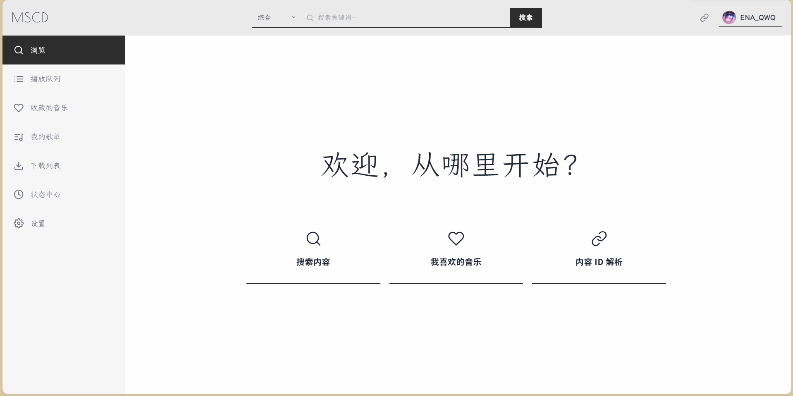
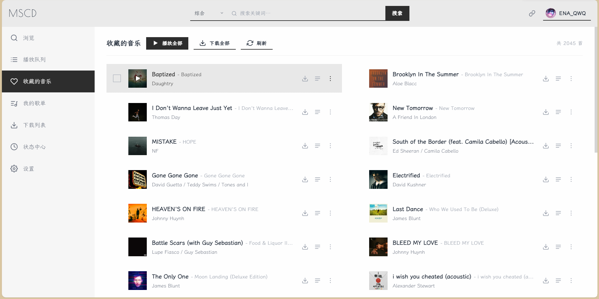
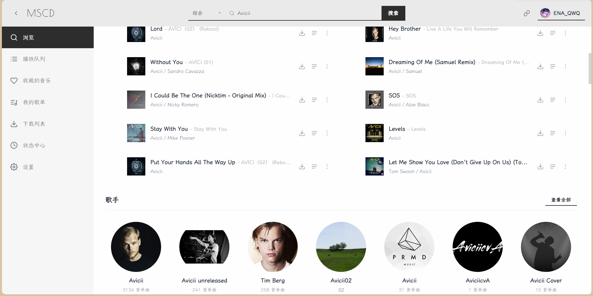
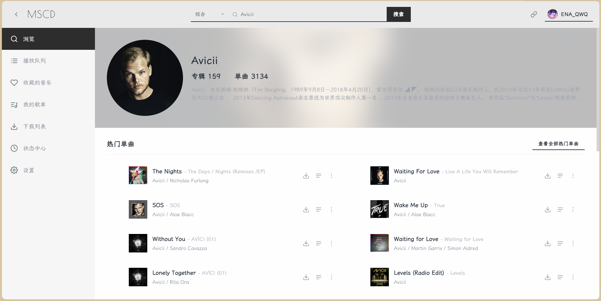
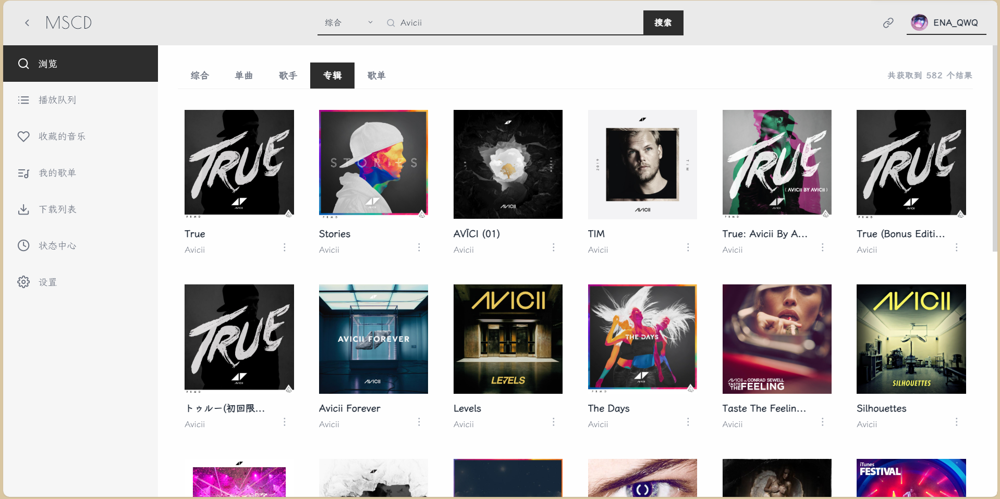
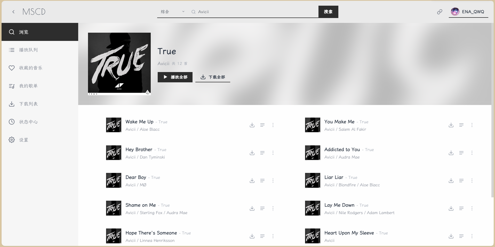
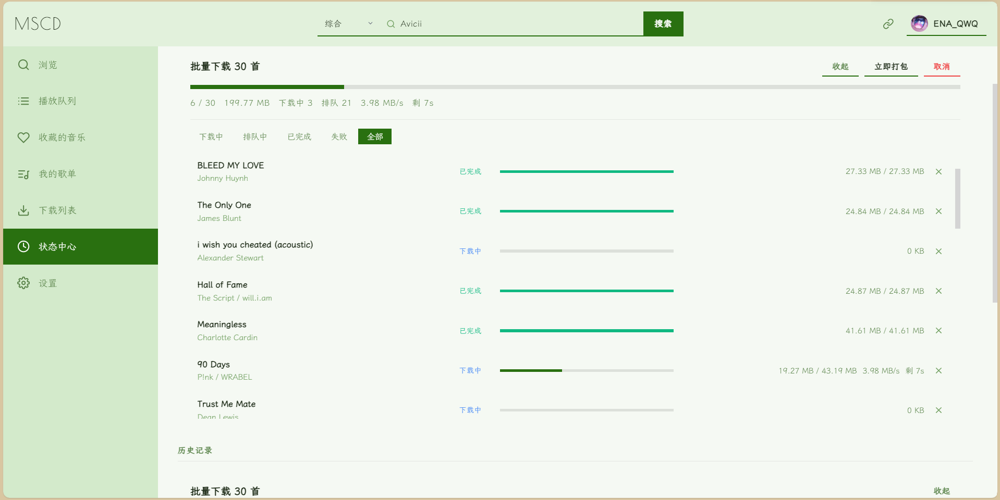
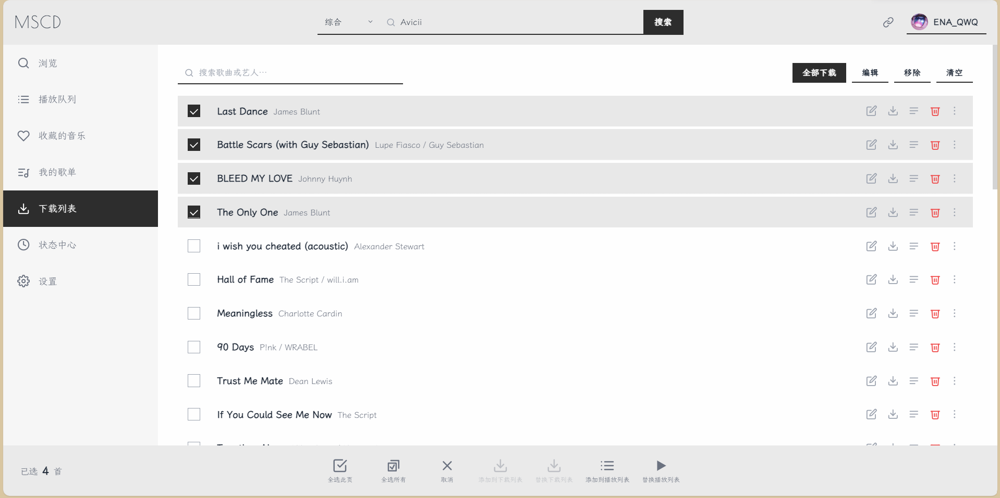
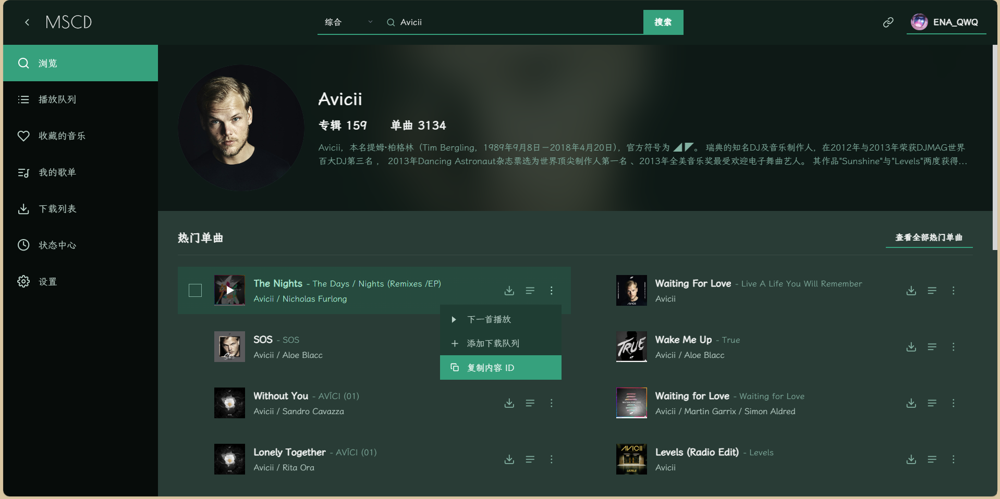
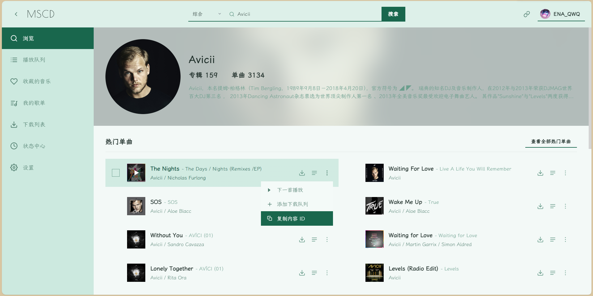

<div align="center">

<br />
<a href="https://github.com/ENA-QWQ/cloudmusic_downloader/blob/main/LICENSE"></a>
<a href="https://pages.cloudflare.com/"></a>


</div>

# MSCD

基于 Meting API / NeteaseCloudMusicApi 兼容接口的纯前端音乐播放与下载器，部署于 Cloudflare Pages，使用 Pages Functions 作为边缘代理层。

本项目仅为 UI 层实现，不提供音乐存储与检索服务。所有数据来源于用户自行配置的第三方 Meting API 或 NeteaseCloudMusicApi 兼容接口。

## 在线演示

https://mscdownload.pages.dev/

## 截图

<details>
<summary>点击展开截图</summary>












</details>


## 架构

- 原生 ES Modules。clone 即可运行。
- `MetingAdapter` 与 `NeteaseAdapter`，通过 `config.services` 按功能维度（search / song / url / lyric / album / playlist / artist / user）路由到不同后端。
- 单例 Store + 订阅模式，所有视图通过 `store.subscribe` 增量渲染，避免全量 DOM 重建。
- `functions/proxy.js` 运行于 Cloudflare Edge，处理 CORS、Range 透传、SSRF 防护与协议升级。

## 项目结构

```
.
├── index.html              # 单页入口
├── app.js                  # 应用引导、路由、事件绑定
├── config.js               # 后端地址、服务路由、超时重试、音质等级
├── styles.css              # 全量样式
├── functions/
│   └── proxy.js            # Cloudflare Pages Function 代理
└── src/
    ├── api.js              # Meting / Netease 双适配器
    ├── components.js       # SongRow / CollectionCard / Modal / Toast / Dropdown
    ├── dom.js              # el() 元素构造器与工具函数
    ├── downloader.js       # 分片下载、标签写入、任务调度、FS Access
    ├── player.js           # 播放器状态机
    ├── store.js            # 全局状态与持久化
    ├── theme.js            # HSL 主题派生
    └── views.js            # Home / Search / Queue / Downloads / Status / Settings / Liked / MyPlaylists
```

## 配置

`config.js` 是唯一的配置入口：

```js
export const config = {
    backend: 'https://api.qijieya.cn/meting/',
    proxy: 'https://mscdownload.pages.dev/proxy?url=',

    backends: {
        meting:  { base: 'https://api.qijieya.cn/meting/' },
        netease: { base: 'https://zm.wwoyun.cn/' },
    },

    services: {
        search:   'netease',
        song:     'meting',
        url:      'meting',
        lyric:    'meting',
        album:    'netease',
        playlist: 'meting',
        artist:   'netease',
        user:     'netease',
    },

    timeout: 15000,
    retry:   { maxRetries: 3, baseDelay: 1000 },
    quality: {
        levels: [
            { id: 128,  label: '标准' },
            { id: 192,  label: '较高' },
            { id: 320,  label: 'HQ'   },
            { id: 2000, label: '无损' },
        ],
        default: 320,
        download: 320,
    },
    download: { concurrency: 3, retry: 3, retryDelay: 1000 },
    ui: { perPage: 50, themeColor: '' },
};
```

### 服务路由说明

| Feature    | 用途                              | 建议后端    |
| ---------- | --------------------------------- | ----------- |
| `search`   | 综合搜索                          | `netease`   |
| `song`     | 单曲详情                          | `meting`    |
| `url`      | 音频直链解析                      | `meting`    |
| `lyric`    | 歌词                              | `meting`    |
| `album`    | 专辑详情与曲目                    | `netease`   |
| `playlist` | 歌单详情与曲目                    | `meting`    |
| `artist`   | 歌手详情、单曲、专辑              | `netease`   |
| `user`     | 用户详情、歌单、喜欢列表          | `netease`   |

`MetingAdapter` 面向 Meting API ，`NeteaseAdapter` 面向 NeteaseCloudMusicApi。

## 部署

### Cloudflare Pages

1. Fork 本仓库。
2. Cloudflare Dashboard → Pages → Create project → 连接 Git 仓库。
3. 构建配置留空：
    - **Build command**：无
    - **Build output directory**：`/`
4. `functions/proxy.js` 会自动被识别为 Pages Functions，部署后生效。
5. 将 `config.js` 中的 `proxy` 改为你的 Pages 域名，例如：
   ```js
   proxy: 'https://your-project.pages.dev/proxy?url=',
   ```

### 后端准备

本项目不自带 API 后端，需自行部署以下任意之一：

**Meting API**：https://github.com/metowolf/Meting
**NeteaseCloudMusicApi**：https://github.com/Binaryify/NeteaseCloudMusicApi

部署后将地址填入 `config.backends.*.base`。

## 本地开发

直接启动静态服务器：

```bash
python -m http.server 8080
```

或使用 Wrangler：

```bash
npx wrangler pages dev . --port 8080
```

打开 `http://localhost:8080`。

**ES Modules 受同源策略限制，不能直接以 `file://` 协议打开 `index.html`。**

## 浏览器兼容性

| 功能                | 依赖                                        | 兼容性                         |
| ------------------- | ------------------------------------------- | ------------------------------ |
| 基础播放与下载      | ES Modules / Fetch / AbortController        | 全部现代浏览器               |
| 流式落盘            | File System Access API                      | Chromium 86+           |
| IndexedDB 句柄持久化 | IndexedDB + 结构化克隆                      | 同 File System Access API      |
| FLAC 标签写入       | 手写解析器                                  | 全部现代浏览器     |
| MP3 标签写入        | `browser-id3-writer`                        | 全部现代浏览器                 |

## 状态持久化

`localStorage` 键名：`meting-app-state`

持久化字段：

```json
{
  "downloads":     [],
  "settings":      {},
  "account":       { "uid": "", "nickname": "", "avatarUrl": "" },
  "queue":         { "tracks": [], "currentIndex": -1, "playMode": "order", "volume": 0.7 },
  "downloadTasks": []
}
```

## 免责声明

- 本项目仅用于前端技术学习，**严禁用于任何商业用途或大规模公开提供服务**。
- 本项目不提供任何音乐存储与搜索服务。所有数据均来源于使用者自行配置的第三方 API。
- 请尊重音乐版权。因使用本项目产生的任何版权纠纷、流量费用及法律风险，与本项目作者无关。

---

Made with ♡ by ENA